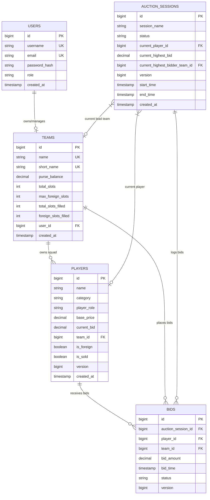

# Database Entity-Relationship (ER) Diagram Documentation

## 📊 Overview
This document specifies the MySQL relational schema design for the **IPL Auction Software**, developed by **Member 3 (Database & Bidding Engine Developer)**.

---

## 🗂️ Mermaid ER Diagram

---

## 🔑 Table Specifications

### 1. `users` Table
- Stores user credentials and system roles.
- Role Constraint: `ADMIN`, `TEAM_OWNER`, `AUCTIONEER`.

### 2. `teams` Table
- Tracks franchise name, remaining purse balance (default ₹100 Crore = 100,000,000.00), and squad constraints (total slots 25, foreign slots 8).
- Foreign Key: `user_id` -> `users.id`.

### 3. `players` Table
- Stores player profile, base price, overseas flag, sold status, and current winning bid.
- Category: `BATSMAN`, `BOWLER`, `ALL_ROUNDER`, `WICKET_KEEPER`.
- Role: `INDIAN`, `FOREIGN`.
- Contains `version` column for JPA Optimistic Locking `@Version`.

### 4. `auction_sessions` Table
- Manages active live auction state, currently bidding player, and current lead franchise.
- Status: `UPCOMING`, `LIVE`, `PAUSED`, `COMPLETED`.

### 5. `bids` Table
- High-concurrency transaction ledger recording every bid attempt by a team.
- Status: `ACCEPTED`, `REJECTED`, `OUTBID`.
- Indexed on `(player_id, bid_amount DESC)` and `(auction_session_id, bid_time DESC)`.
