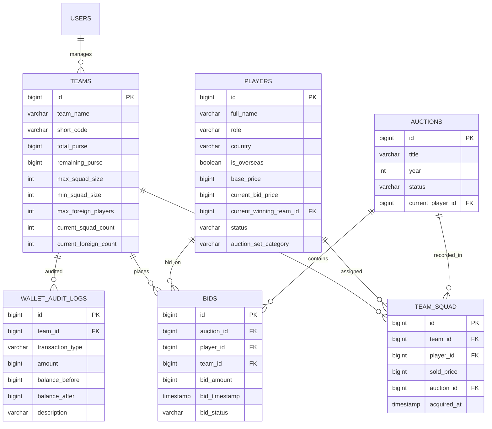

# 🏏 IPL Mega Auction Software

[](https://www.oracle.com/java/)
[](https://spring.io/projects/spring-boot)
[](https://spring.io/projects/spring-security)
[](https://www.mysql.com/)
[](https://junit.org/)
[](LICENSE)

An enterprise-grade, real-time **IPL Mega Auction Software** platform engineered with **Java 17, Spring Boot 3.x, Spring Data JPA, MySQL, Spring Security 6 (JWT + RBAC)**, and a modern responsive **Single Page Application (SPA)** frontend.

The platform simulates live BCCI Indian Premier League auctions with **high-concurrency live bidding, pessimistic write locking, purse deduction engines, Right To Match (RTM) card management, accelerated auction rounds, BCCI regulatory compliance audits**, and **macro auction analytics**.

---

## 👥 5-Member Team Roles & Scope Matrix

The project development is distributed cleanly across **5 specialized engineering roles** working in parallel branches to guarantee separation of concerns:

| Member & Role | Assigned Domain | Core Focus Areas | Dedicated Branch |
| :--- | :--- | :--- | :--- |
| **Member 1: Project Lead & Core Backend Developer** | Architecture & Core REST APIs | Spring Boot project architecture, Team CRUD, Player CRUD, Purse deduction logic, Squad reserve constraints, Global Exception Handler, RTM Engine, Accelerated Phase, Compliance Audits, Macro Reports | `main` / `develop` |
| **Member 2: Security & Authentication Specialist** | Security & RBAC | Spring Security 6, Stateless JWT Provider (`JwtUtils`), Request Filter (`JwtAuthenticationFilter`), Auth REST APIs (`/api/v1/auth/register`, `/api/v1/auth/login`), Role-Based Access Control (`ADMIN` vs `TEAM_OWNER`) | `feature/security-auth` |
| **Member 3: Database & Bidding Engine Developer** | JPA & Concurrency | MySQL DDL `schema.sql`, JPA Entities, Flyway migrations, Dynamic IPL bid increments, Pessimistic Row Locking (`SELECT ... FOR UPDATE`), Double-bid race condition prevention, Financial Audit Ledger | `feature/database-bidding` |
| **Member 4: Frontend UI & Real-Time Portal Lead** | Web UI & Client Integration | Glassmorphism & Neon theme, Auth Screens (Login/Register), Admin Onboarding Console, Live Auction Room (Player card, dynamic increment controls, active bidder), Team Squad & Purse Tracker | `feature/frontend-ui` |
| **Member 5: QA, Testing & API Documentation Lead** | QA, Automation & CI/CD | OpenAPI / Swagger UI 3 (`/swagger-ui.html`), Postman Collections & Environments, JUnit 5 & Mockito Unit Test Suite, `@SpringBootTest` Integration Tests, Multi-threaded Concurrency Stress Tests, GitHub Actions CI Pipeline | `feature/qa-testing-docs` |

---

## 📅 12-Week Roadmap & Weekly Milestones (Weeks 1 – 10 Completed)

```
Week 1  ──► Architecture Scaffolding & Git Branching Setup
Week 2  ──► Team CRUD Management APIs & DTO Models
Week 3  ──► Player CRUD Management APIs & Category Staging Pools
Week 4  ──► Centralized Global Exception Handler (@RestControllerAdvice)
Week 5  ──► Team Purse Deduction Engine & Minimum Squad Reserve Rule
Week 6  ──► Franchise Roster Constraints (18–25 Squad Size, Max 8 Overseas)
Week 7  ──► Player Lifecycle State Machine & Auctioneer Podium Endpoints
Week 8  ──► Franchise Purse Queries & Financial Audit Ledger Integration
Week 9  ──► API Contract Stabilization, CORS Config & Unified Response Envelope
Week 10 ──► Advanced IPL Mechanics: RTM Engine, Accelerated Round, BCCI Compliance Audit & Macro Reports
Week 11 ──► [In Progress] End-to-End WebSocket / STOMP Live Auction Room Broadcasts
Week 12 ──► Final Production Packaging, Docker Containerization & Deployment
```

---

## 🌟 Key Platform Modules & Features

### 1. Franchise & Player Management
* **Franchise Onboarding**: Register teams with starting purse budget (default ₹100 Crore).
* **Purse & Squad Constraints**:
  - Minimum squad size: **18 players**; Maximum squad size cap: **25 players**.
  - Maximum foreign players: **8 overseas** per franchise.
  - Minimum squad reserve fund rule enforced on every bid:
    $$\text{Reserve Fund} = (18 - \text{squadCount}) \times ₹20\,\text{Lakhs}$$
* **Player Lifecycle State Machine**:
  - Categorization: `BATSMAN`, `BOWLER`, `ALL_ROUNDER`, `WICKET_KEEPER`.
  - State transitions: `AVAILABLE` $\rightarrow$ `IN_AUCTION` $\rightarrow$ `SOLD` / `UNSOLD`.

### 2. Concurrency-Controlled Bidding Engine
* **Dynamic IPL Bid Increments**:
  - Current Bid $< ₹1.00\,\text{Cr} \implies \mathbf{+\,₹10\,\text{Lakhs}}$
  - $₹1.00\,\text{Cr} \le \text{Current Bid} < ₹5.00\,\text{Cr} \implies \mathbf{+\,₹20\,\text{Lakhs}}$
  - $₹5.00\,\text{Cr} \le \text{Current Bid} < ₹10.00\,\text{Cr} \implies \mathbf{+\,₹25\,\text{Lakhs}}$
  - Current Bid $\ge ₹10.00\,\text{Cr} \implies \mathbf{+\,₹50\,\text{Lakhs}}$
* **Pessimistic Concurrency Locking**: Uses `@Lock(LockModeType.PESSIMISTIC_WRITE)` to serialize simultaneous bids on the same player, preventing race conditions.
* **Self-Outbidding Prevention**: Blocks a franchise holding the winning bid from bidding against itself.

### 3. Spring Security 6 & JWT Authentication
* **Stateless Session Architecture**: Stateless JWT Bearer token authentication.
* **Password Hashing**: Industry-standard `BCryptPasswordEncoder`.
* **Role-Based Access Control (RBAC)**:
  - `ROLE_ADMIN`: Auctioneer controls (staging players, striking hammer, regulatory audits).
  - `ROLE_TEAM_OWNER`: Submitting bids, shortlisting players, exercising RTM cards.

### 4. Advanced IPL Auction Rules (Week 10 Deliverables)
* **Right To Match (RTM) Engine**:
  - Enforces BCCI limit of **2 RTM cards** per franchise.
  - Matches the highest hammer bid price, automatically refunds previous bidder's purse, debits matching team, and reassigns squad roster atomically.
* **Accelerated Auction Round**:
  - Automated pooling of unsold and available cricketers.
  - Franchise nomination mechanism (`POST /api/v1/auction/accelerated/nominate`) and fast-track podium staging.
* **BCCI Roster & Purse Compliance Audit**:
  - League-wide and single-team audits verifying:
    1. Squad size between 18 and 25 players.
    2. Overseas quota $\le 8$.
    3. Minimum purse expenditure: At least **75% of total purse** ($₹75\,\text{Cr}$) spent.
    4. Balanced role composition: $\ge 3$ batsmen, $\ge 3$ bowlers, $\ge 2$ all-rounders, $\ge 1$ wicket-keeper.
* **Macro Auction Analytics & Team Roster Exports**:
  - Macro statistics on total spend across franchises, record buys, category spend breakdown, and full team roster exports.

---

## 🔌 REST API Catalog

### 🔐 Authentication (`/api/v1/auth`)
| Method | Endpoint | Description | Access |
| :--- | :--- | :--- | :--- |
| `POST` | `/api/v1/auth/register` | Register new franchise owner or admin | Public |
| `POST` | `/api/v1/auth/login` | Login and receive JWT bearer token | Public |

### 🏢 Franchise Management (`/api/v1/teams`)
| Method | Endpoint | Description | Access |
| :--- | :--- | :--- | :--- |
| `POST` | `/api/v1/teams` | Register a new franchise | Admin |
| `GET` | `/api/v1/teams` | List all franchises | Authenticated |
| `GET` | `/api/v1/teams/{id}` | Get franchise details by ID | Authenticated |
| `PUT` | `/api/v1/teams/{id}` | Update franchise info/budget | Admin |
| `DELETE` | `/api/v1/teams/{id}` | Remove franchise | Admin |
| `GET` | `/api/v1/teams/{id}/purse-summary` | Real-time purse balance, squad count & quota | Authenticated |
| `GET` | `/api/v1/teams/purse-summary` | League-wide purse summaries | Authenticated |
| `GET` | `/api/v1/teams/{id}/compliance` | Audit franchise against BCCI roster rules | Admin / Owner |
| `GET` | `/api/v1/teams/compliance-overview` | League-wide BCCI compliance scorecard | Admin |

### 🏏 Player Management (`/api/v1/players`)
| Method | Endpoint | Description | Access |
| :--- | :--- | :--- | :--- |
| `POST` | `/api/v1/players` | Register cricketer into auction pool | Admin |
| `GET` | `/api/v1/players` | List all cricketers with category filters | Authenticated |
| `GET` | `/api/v1/players/{id}` | Get cricketer details by ID | Authenticated |
| `PUT` | `/api/v1/players/{id}` | Update cricketer base price or details | Admin |
| `DELETE` | `/api/v1/players/{id}` | Remove player from auction staging | Admin |

### 🔨 Live Auctioneer Workflows (`/api/v1/auction`)
| Method | Endpoint | Description | Access |
| :--- | :--- | :--- | :--- |
| `POST` | `/api/v1/auction/stage` | Bring cricketer to active podium | Admin |
| `POST` | `/api/v1/auction/players/{id}/hammer/sold` | Hammer strike: SOLD (deduct purse & assign squad) | Admin |
| `POST` | `/api/v1/auction/players/{id}/hammer/unsold` | Hammer strike: UNSOLD (moves player to unsold pool) | Admin |
| `GET` | `/api/v1/teams/{teamId}/rtm` | Query franchise RTM card balance | Authenticated |
| `POST` | `/api/v1/auction/rtm/exercise` | Match winning bid and acquire cricketer via RTM | Admin / Owner |
| `GET` | `/api/v1/auction/accelerated/pool` | Retrieve accelerated round unsold & nominated pool | Authenticated |
| `POST` | `/api/v1/auction/accelerated/nominate` | Submit franchise shortlist nominations | Owner |
| `POST` | `/api/v1/auction/accelerated/stage/{id}` | Stage nominated player to accelerated podium | Admin |

### 💰 Live Bidding Engine (`/api/v1/bids`)
| Method | Endpoint | Description | Access |
| :--- | :--- | :--- | :--- |
| `POST` | `/api/v1/bids/place` | Place concurrent live bid with lock protection | Team Owner |
| `GET` | `/api/v1/bids/player/{id}/current` | Get current highest bid on active cricketer | Authenticated |
| `GET` | `/api/v1/bids/player/{id}/history` | Get audit log of all bids on cricketer | Authenticated |

### 📊 Analytics & Reports (`/api/v1/reports`)
| Method | Endpoint | Description | Access |
| :--- | :--- | :--- | :--- |
| `GET` | `/api/v1/reports/auction-summary` | Whole-auction macro statistics & category spend | Authenticated |
| `GET` | `/api/v1/reports/teams/{id}/roster-export` | Export full franchise squad composition | Authenticated |

---

## 🗄️ Database Architecture & ER Model

Detailed entity relationship specifications and diagrams are documented in [ER_DIAGRAM.md](ER_DIAGRAM.md).



---

## 💻 Tech Stack & Libraries

* **Core Platform**: Java 17, Spring Boot 3.2.3
* **Persistence & ORM**: Spring Data JPA, Hibernate, MySQL 8.0, Flyway / Liquibase migrations
* **Security & Auth**: Spring Security 6, JJWT (Java JWT `0.11.5`), BCrypt Password Encoder
* **Documentation**: Springdoc OpenAPI / Swagger UI 3 (`v3/api-docs`, `/swagger-ui.html`)
* **Testing**: JUnit 5, Mockito, Spring Boot Test, H2 In-Memory DB (test profile), `CountDownLatch` concurrency stress tests
* **Frontend UI**: Responsive HTML5, Vanilla CSS3 (Glassmorphism & Neon theme), Modern JavaScript (Fetch API, JWT interceptors)

---

## 🚀 Setup & Execution Guide

### Prerequisites
* **Java 17+** (JDK 17 or higher)
* **Maven 3.8+** (or use included `./mvnw.cmd` wrapper)
* **MySQL 8.0+** (Optional: H2 in-memory is auto-configured for tests and local fallback)

### 1. Clone the Repository
```bash
git clone https://github.com/srijansrivastava1234/-ipl-auction-software.git
cd -ipl-auction-software
```

### 2. Configure Database
By default, the application runs against MySQL using `application.yml`:
```yaml
spring:
  datasource:
    url: jdbc:mysql://localhost:3306/ipl_auction_db?useSSL=false&serverTimezone=UTC&createDatabaseIfNotExist=true
    username: root
    password: root
```
*(Or set environment variables `DB_URL`, `DB_USERNAME`, `DB_PASSWORD`).*

### 3. Build the Backend
```bash
# Clean and compile
./mvnw.cmd clean compile

# Compile tests
./mvnw.cmd test-compile
```

### 4. Run Automated Tests
```bash
./mvnw.cmd test
```
All **18 automated tests** (Unit tests, Concurrency lock tests, and Week 10 integration tests) will execute with zero failures:
```text
[INFO] Results:
[INFO] Tests run: 18, Failures: 0, Errors: 0, Skipped: 0
[INFO] ------------------------------------------------------------------------
[INFO] BUILD SUCCESS
[INFO] ------------------------------------------------------------------------
```

### 5. Launch the Application
```bash
./mvnw.cmd spring-boot:run
```
* **Backend API Base**: `http://localhost:8080`
* **Swagger UI Documentation**: `http://localhost:8080/swagger-ui.html`
* **OpenAPI 3 JSON Spec**: `http://localhost:8080/v3/api-docs`

### 6. Launch the Frontend UI
Simply open `index.html` in any modern web browser or serve via:
```bash
# Using Node.js live-server or python http.server
npx -y serve .
```

---

## 📁 Repository Directory Structure

```text
├── .github/
│   └── workflows/
│       └── ci.yml                     # Automated GitHub Actions CI pipeline
├── css/
│   ├── components.css                 # Glassmorphism cards, buttons & modals
│   ├── style.css                      # Base layout & typography
│   └── variables.css                  # Dark neon IPL color scheme variables
├── js/
│   ├── admin-controller.js            # Admin player & franchise onboarding UI
│   ├── api.js                         # API wrapper with JWT Bearer injection
│   ├── app.js                         # SPA navigation & tab router
│   ├── auction-controller.js          # Live bidding podium controls
│   ├── auth-controller.js             # Login & registration forms
│   └── squad-controller.js            # Team roster & purse progress bars
├── docs/
│   ├── MEMBER_1_WEEKS_1_TO_10_WORK.md # Detailed Member 1 weekly sprint logs
│   ├── member-1-progress.md           # Member 1 milestone audit log
│   └── team-breakdown-weeks-1-to-10.md# 5-member team scope & roadmap
├── postman/
│   ├── IPL_Auction_Collection.postman_collection.json # Automated API test collection
│   └── IPL_Auction_Environment.postman_environment.json# Environment configurations
├── src/
│   ├── main/
│   │   ├── java/com/ipl/auction/
│   │   │   ├── config/                # SecurityConfig, JpaAuditing, OpenApiConfig
│   │   │   ├── controller/            # REST Controllers (Team, Player, Auction, Bid, RTM, Reports)
│   │   │   ├── dto/                   # Request & Response Data Transfer Objects
│   │   │   ├── entity/                # JPA Entities (Team, Player, Bid, Auction, TeamSquad, AuditLog)
│   │   │   ├── exception/             # Centralized GlobalExceptionHandler & Custom Exceptions
│   │   │   ├── repository/            # Spring Data JPA Repositories with LockModeType
│   │   │   ├── security/              # JwtUtils, JwtAuthenticationFilter, UserDetails
│   │   │   └── service/               # Core business services & validation engines
│   │   └── resources/
│   │       ├── application.yml        # Production / MySQL configuration
│   │       ├── application-test.yml   # H2 in-memory test configuration
│   │       ├── data.sql               # Seed data (10 IPL teams, 15 marquee players)
│   │       ├── schema.sql             # MySQL DDL schema
│   │       └── db/migration/          # Flyway SQL migration scripts
│   └── test/
│       └── java/com/ipl/auction/
│           ├── concurrency/           # BiddingEngineConcurrencyTest (multi-threaded)
│           └── service/               # Unit and Integration test suites (Week 10)
├── ER_DIAGRAM.md                      # Comprehensive Database ER Specifications
├── index.html                         # Frontend Single Page Application entry point
├── pom.xml                            # Maven project configuration & dependencies
└── README.md                          # Master project documentation
```

---

## 👥 Contributors

* **Member 1**: Srijan Srivastava ([@srijansrivastava1234](https://github.com/srijansrivastava1234)) — *Project Lead & Core Backend REST API Developer*
* **Member 2**: *Security & Authentication Specialist*
* **Member 3**: *Database & Bidding Engine Developer*
* **Member 4**: *Frontend UI & Real-Time Portal Lead*
* **Member 5**: *QA, Testing & API Documentation Lead*

---

## 📜 License
This project is licensed under the MIT License — see the [LICENSE](LICENSE) file for details.
